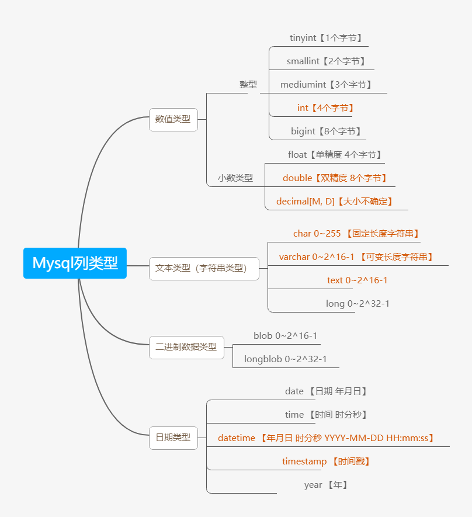

## Mysql常用数据类型（列类型）



## 数值型（整数）的基本使用

说明，使用规范：在能够满足需求的情况下，尽量选择占用空间小的类型

如果没有指定unsigned，则是有符号的数据，如果指定unsigned，则是无符号的数据

## 数值型（bit）的使用

1. 基本使用
   ```mysql
   mysql> create table t02(num bit(8));
   mysql> insert into t02(1, 3);
   mysql> insert into t02 values(2, 65);
   ```
2. 细节说明
   - bit字段显示时，按照 位 的方式显示
   - 查询的时候仍然可以使用添加的数值
   - 如果一个值只有0, 1，可以考虑使用bit（1），可以节约空间
   - 位类型，M指定位数，默认值1， 范围1-64
   - 使用不多

## 数值型（小数）的基本使用

1. FLOAT/DOUBLE [UNSIGNED]
   
   Float 单精度， Double 双精度
2. DECIMAL[M,D] [UNDSIGNED]
   - 可以支持更加精确的小数位。M是小数位数（精度）的总数，D是小数点（标度）后面的位数
   - 如果D是0，则值没有小数点或分数部分。M最大65。D最大是30。如果D被省略，默认是0。如果M被省略，默认是10。
   - 建议：如果希望小数的精度高，推荐使用decimal

## 字符串的基本使用

- CHAR(size)
  
  固定长度字符串，最大255==字符==
- VARCHAR(size) 0~65535  size = (65535-3)/3 = 21844（uft8编码下）
  
  可变长度字符串，最大65532==字节==【==utf8编码最大21844字符（因为utf8编码中，每三个字节代表一个字符）== 1-3个字节用于记录大小】

### 字符串使用细节

1. char(4)  这个4表示字符数（最大255），不是字节数，不管是中文还是字母都是放4个，按字符计算
   
   varchar(4)  这个4表示字符数，不管是字母还是中文都以定义好的表的编码来存放数据，不管是中文还是字母都最多存放4个，按字符计算
2. char(4) 是定长（固定的大小），就是说，即使你插入‘aa‘，也会占用 分配的4个字符空间
   
   varchar(4) 是变长（变化的大小），就是说，如果你插入插入了‘aa’，实际占用空间大小并不是4个字符，而是按照实际占用空间来分配（varchar本身还需要占用1-3个字节来记录存放内容长度）L（实际数据大小）+（1-3）字节
3. 什么时候使用char，什么时候使用varchar
   1. 如果数据是定长，推荐使用char，比如md5的密码，邮编，手机号，身份证号码等。char(32)
   2. 如果一个字段的长度是不确定，我们使用varchar，比如留言，文章
   
   查询速度：char > varchar
4. 在存放文本时，也可以使用Text数据类型，可以将Text列视为VARCHAR列，注意Text不能有默认值，大小0~2^16字节，如果希望存放更多字符，可以选择MEDIUMTEXT 0~2^24 或者 LONGTEXT 0~2^32

## 日期类型的基本使用

```mysql
CREATE TABLE birthday(
t1 DATE,
t2 DATETIME,
t3 TIMESTAMP 
   NOT NULL DEFAULT CURRENT_TIMESTAMP//不允许为空，默认为当前时间
   ON UPDATE CURRENT_TIMESTAMP//在修改时以当前时间更新
);timestamp时间戳

mysql> INSERT INTO birtday(t1, t2) VALUES('2022-11-111', '2022-11-11 10:10:10');
```

### 日期类型的细节说明

TimeStamp 在 Insert 和 Update 时，自动更新
