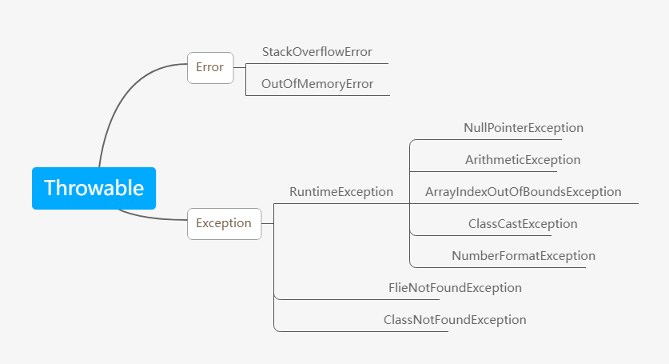

## 基本概念

Java语言中，将程序执行中发生的不正常情况称为“异常”。（开发过程中的语法和逻辑错误不是异常）

## 执行过程中所发生的异常事件可分为大两类

1. Error（错误）：Java虚拟机无法解决的严重问题，如：JVM系统内部错误，资源耗尽等严重情况。比如StackOverflowError【栈溢出】和OOM（out of memory），Error是严重错误，程序会崩溃
2. Exception：其他因编程错误或偶然的外在因素导致的一般性问题，可以使用针对性的代码进行处理。例如空指针访问，试图读取不存在的文件，网络连接中断等等，Exception分为两大类：运行时异常【程序运行时发生的异常】和编译时异常【编程时编译器发现的异常】



## 异常体系图小结

1. 异常分为两大类，运行时异常和编译时异常
2. 运行时异常，编译器不要求强制处置的异常，一般是指编程时的逻辑错误，是程序员应该避免其出现的异常。java.lang.RuntimeException类及它的子类都是运行时的异常
3. 对于运行时的异常，可以不做处理，因为这类异常很普遍，若全处理可能会对程序的可读性和运行效率产生影响
4. 编译时异常，是编译器要求必须处置的异常

## 常见的运行时异常

常见的运行时异常包括：

1. NullPointerException空指针异常
   
   当应用程序试图在需要对象的地方使用null时，抛出该异常
   ```java
   String name = null;
   name.length();//抛出空指针异常
   ```
2. ArithmeticException数学运算异常
   
   当出现异常的运算条件时，抛出该异常，例如，一个整数“除以零”时，抛出此类的一个实例
   ```java
   int num1 = 10;
   int num2 = 0;
   num1/num2;//抛出数学运算异常
   ```
3. ArrayIndexOutOfBoundsException数组下标越界异常
   
   用非法索引访问数组时抛出的异常，如果索引为负或大于等于数组大小，则该索引为非法索引
   ```java
   int[] arr = new int[4];
   arr[4];//抛出数组下标越界异常
   ```
4. ClassCastException类型转换异常
   
   当试图将对象强制转换为不是实例的子类时，抛出该异常
   ```java
   class A{};
   class B extends A{};
   class c extends A{};
   
   public static void main(String[] args){
     A a = new B();
     B b = (B)a;
     C c = (C)a;//抛出类型转换异常
   }
   ```
5. NumberFormatException数字格式不正确异常
   
   当应用程序试图将字符串转换成一种数值类型，但该字符串不能转换为适当格式时，抛出该异常--->>使用异常我们可以确保输入时满足条件的数字
   ```java
   String name = "程柯嘉";
   int num = Ingeter.parseInt(name);//爬出数字格式不正确异常
   ```

# 编译异常

编译异常是指在编译期间，就必须处理的异常，否则代码不能通过编译

## 常见的编译异常

1. SQLException//操作数据库时，查询表可能发生的异常
2. IOException//操作文件时，发生的异常
3. FileNotFoundException//当操作一个不存在的文件时，发生异常
4. ClassNotFoundException加载类，而该类不存在时，异常
5. EOFException//操作文件，到文件末尾发生异常
6. IllegalArguementException//参数异常