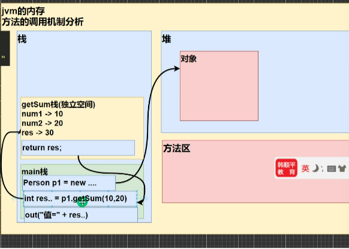

## 方法的调用机制分析

1. 当程序执行到方法时，就会开辟一个独立的空间（栈空间）
2. 当方法执行完毕，或者执行到return语句时，就会返回
3. 返回到调用方法的地方
4. 返回后，继续执行方法后面的代码
5. 当mian方法（栈）执行完毕，整个程序退出
   
   

## 成员方法的好处

1. 提高代码的复用性
2. 可以将实现的细节封装起来，然后供其他用户来调用即可

## 成员方法的定义

```java
访问访问修饰符 返回数据类型 方法名（参数列表）{//方法体
    语句;
    return 返回值;
}
```

1. 参数列表：表示成员方法输入
2. 数据类型（返回类型）：表示成员方法输出，void表示没有返回值
3. 方法主体：表示为了实现某一功能代码块
4. return语句不是必须的

## 注意事项和使用细节

1. ### 修饰符
   1. 修饰符（作用是控制方法使用的范围）如果不写，默认访问，有四种可选[public,protected,private,默认]
2. ### 返回类型
   1. 一个方法最多有一个返回值
   2. 返回类型可以为任意类型，包含基本类型或引用类型
   3. 如果方法要求有返回数据类型，则方法体中最后的执行语句必须为return 值；而且要求返回值类型必须和return的值类型一致或兼容
   4. 如果方法是void，则方法体中可以没有return语句，或者只写return；
   5. 方法名命名遵循小驼峰命名法，最好见名知意
3. ### 参数列表
   1. 一个方法可以有0个参数，也可以有多个参数，中间用逗号隔开
   2. 参数类型可以为任意类型，包含基本类型或引用类型
   3. 调用带参数的方法时，一定对应着参数列表传入相同类型或兼容类型的参数
   4. 方法定义时的参数称为形式参数，简称形参；方法调用时的参数称为实际参数，简称实参，实参和形参的类型要一致或兼容，个数和顺序必须一致
4. ### 方法体
   
   里面写完成功能的具体的语句，可以为输入，输出，变量，运算，分支，循环，方法调用，但里面不能再定义方法，即：方法不能嵌套定义

## 方法细节调用说明

1. 同一个类中的方法调用：直接调用即可
2. 跨类中的方法A类调用B类方法：需要通过对象名调用，比如：对象名.方法名(参数)
3. 特别说明：跨类的方法调用和方法的访问修饰符相关

## 成员方法传参机制

基本数据类型，传递的是值（值拷贝），形参的任何改变不影响实参

引用类型传递的是地址（传递也是值，但值是地址），可以通过形参影响实参
