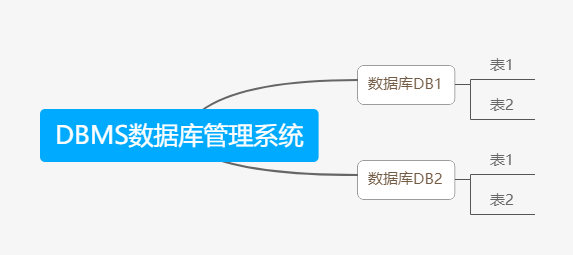

1. 所谓安装Mysql数据库，就是在主机安装一个数据库管理系统（DBMS），这个管理程序可以管理多个数据库。DBMS（database manage system）
2. 一个数据库中可以创建多个表，以保存数据（信息）
3. 数据库管理系统（DBMS），数据库和表的关系如图：
   
   

Mysql数据库-普通表的本质仍然是文件

## 数据在数据库中的存储方式

表的一行称之为一条记录-->在java程序中，一行记录往往使用一个对象来记录

## SQL语句分类

- DDL：数据定义语句【create 表， 库...】
- DML：数据操作语句【增加 insert， 删除 delete， 修改 update】
- DQL：数据查询语句【select】
- DCL：数据控制语句【管理数据库：比如用户权限 grant revoke】
