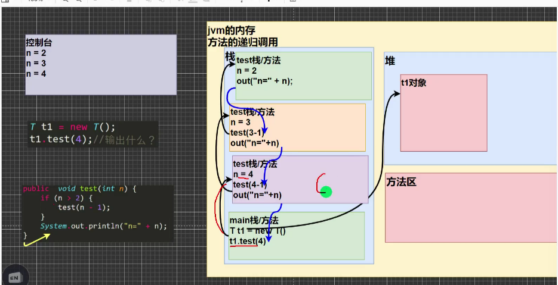

递归就是方法自己调用自己，每次调用时传入不同的变量

## 递归重要规则

1. 执行一个方法时，就创建一个新的受保护的独立空间（栈空间）
2. 方法的局部变量是独立的，不会互相影响，比如n变量
3. 如果方法中使用的是引用类型变量（比如数组），就会共享该引用类型的数据
4. 递归必须向退出递归的条件逼近，否则就是无限递归
5. 当一个方法执行完毕，或者遇到return，就会返回，遵守谁调用就将结果返回给谁，同时当方法执行完毕或者返回时，该方法也就执行完毕
