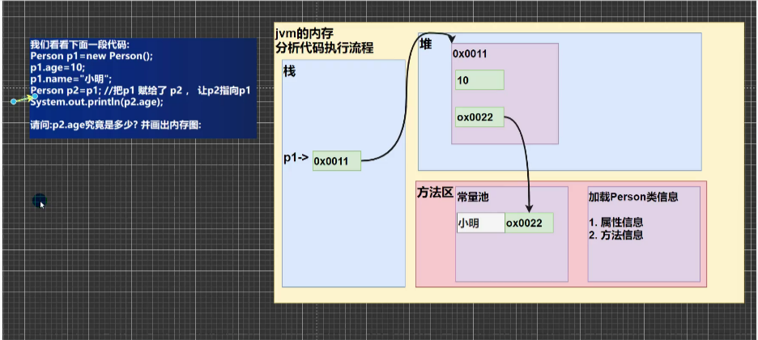

# 属性/成员变量

## 基本介绍

1. 从概念或叫法上看：成员变量 = 属性 = field（字段）（即 成员变量是用来表示属性的）
2. 属性是类的一个组成部分，一般是基本数据类型，也可以是引用类型（对象，数组）

## 注意事项和细节说明

1. 属性的定义语法同变量，示例：==访问修饰符 属性类型 属性名==
   
   （访问修饰符：控制属性的访问范围）
   
   （四种访问修饰符：protected，public，private，默认）
2. 属性的定义类型可以为任意类型，包含基本类型或引用类型
3. 属性如果不赋值，有默认值，规则和数组一致

## 如何创建对象

1. 先声明再创建
   ```java
   Cat c;
   c = new Cat();
   ```

    2.直接创建

```java
Cat c = new Cat();
```

## 如何访问属性

对象名.属性名；

## 类和对象的内存分配机制

1. 栈：一般存放基本数据类型（局部变量）
2. 堆：存放对象（Cat cat，数组等）
3. 方法区：常量池（常量，比如字符串），类加载信息


