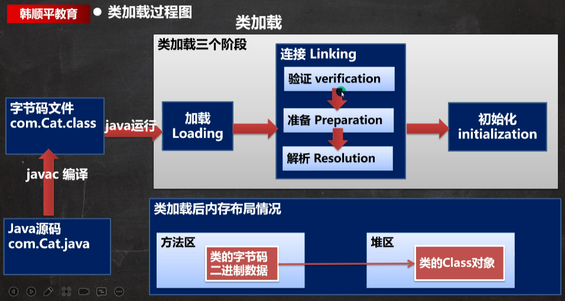
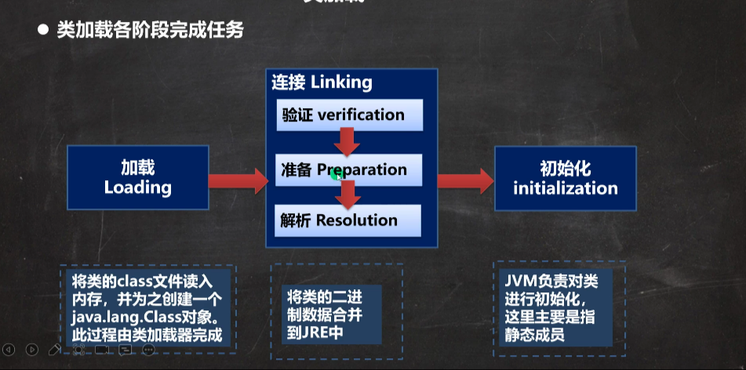

## 基本说明

反射机制式java实现动态语言的关键，也就是通过反射实现类动态加载

1. 静态加载：编译时加载相关的类，如果没有则报错，依赖性太强
2. 动态加载：运行时加载需要的类，如果运行时不用该类，即使不存在该类，也不报错，降低了依赖性

## 类加载时机

1. 当创建对象时（new）//静态加载
2. 当子类被加载时 //静态加载
3. 调用类中的静态成员时 //静态加载
4. 通过反射 //动态加载

## 类加载流程图

## 类加载的五个阶段

### 加载阶段

JVM在该阶段的主要目的是将字节码从不同的数据源（可能是class文件，也可能是jar包，甚至网络）转化为二进制字节流加载到内存中，并生成一个代表该类的java.lang.Class对象

### 连接阶段-验证

1. 对是为了确保Class文件的字节流中包含的信息符合当前虚拟机的要求，并且不会危害虚拟机自身的安全
2. 包括：文件格式验证（是否以魔数 oxcafebabe开头），元数据验证，字节码验证和符号引用验证
3. 可以考虑使用 -Xverify:none参数来关闭大部分的类验证措施，缩短虚拟机类加载的时间

### 连接阶段-准备

JVM会在该阶段对静态变量，分配内存并初始化（对应数据类型的默认初始值，如 0， 0L， null， false等）。这些变量所使用的内存都将在方法区中进行分配

### 连接阶段-解析

虚拟机将常量池内的符号引用替换为直接引用的过程

### Initialization（初始化）

1. 到初始化阶段，才真正开始执行类中定义的Java程序代码，此阶段是执行\<clinit>()方法的过程
2. \<clinit>()方法是由编译器按语句在源文件中出现的顺序，==依次==自动收集类中的所有静态变量的赋值动作和静态代码块中的语句，并进行合并
3. 虚拟机会保证一个类的\<clinit>()方法在多线程环境中被正确的加锁，同步，如果多个线程同时去初始化一个类，那么只会有一个线程去执行这个类的\<clinit>()方法，其他线程都需要阻塞等待，直到活动线程执行\<clinit>()方法完毕
   
   正因为有这个机制，才能保证某个内在内存中，只有一个Class对象
