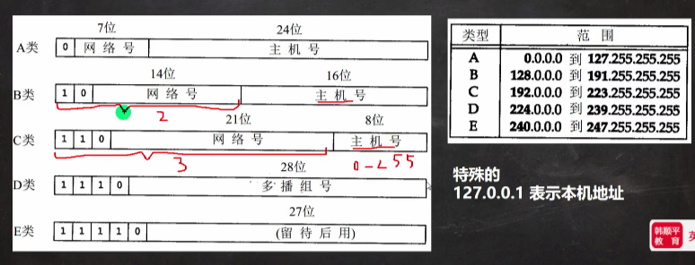
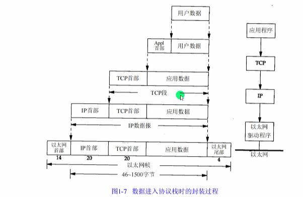

## 网络通信

1. 概念：两台设备之间通过网络实现数据传输
2. 网络通信：将数据通过网络从一台设备传输到另一台设备
3. java.net包下提供了一系列的类或接口，供程序员使用，完成网络通信

## 网络

1. 概念：两台或多台设备通过一定物理设备连接起来构成了网络
2. 根据网络的覆盖范围不同，对网络进行分类
   - 局域网：覆盖范围最小，仅仅覆盖一个教室或一个机房
   - 城域网：覆盖范围较大，可以覆盖一个城市
   - 广域网：覆盖范围最大，可以覆盖全国，甚至全球，万维网是广域网的代表

## ip地址

1. 概念：用于唯一标识网络中的每台计算机
2. 查看ip地址：ipconfig
3. ip地址的表示形式：点分十进制  xx.xx.xx.xx
4. 每一个十进制数的范围：0-255
5. ip地址的组成 = 网络地址 + 主机地址，比如192.168.16.69
6. IPv6是互联网工程任务组设计的用于替代IPv4的下一代IP协议，其地址数量号称可以为全世界的每一粒沙子编上一个地址
7. 由于IPv4最大的问题在于网络地址资源有限，严重制约了互联网的应用和发展，IPv6的使用，不仅能解决网络地址资源数量的问题，而且也解决了多种接入设备连入互联网的障碍

## ipv4地址分类

## 域名

1. www.baidu.com
2. 好处：为了方便记忆，解决记ip的困难
3. 概念：将ip地址映射成域名

## 端口号

1. 概念：用于标志计算机上某个特定的网络程序
2. 表示形式：以整数形式，范围0-65535【2个字节表示端口0-2^16-1】
3. 0-1024已经被占用，比如ssh 22, ftp 21, smtp 25, http 80
4. 常见的网络程序端口号：
   1. tomcat：8080
   2. mysql：3306
   3. oracle：1521
   4. sqlserver：1433

## 网络通信协议

### 协议（tcp/ip）

TCP/IP(Transmission Control Protocol/Internet Protocol）的简写，中文译名为传输控制协议/因特网互联协议，又叫网络通讯协议，这个协议是Internet最基本的协议，Internet国际互联网络的基础，简单的说，就是由网络层的IP协议和传输层的TCP协议组成的

|OSI模型|TCP/IP模型|TCP/IP模型各层对应协议|
|--|--|--|
|应用层|应用层|HTTP,ftp,telnet,DNS|
|表示层|||
|会话层|||
|传输层|传输层|TCP,UDP|
|网络层|网络层|IP,ICMP,ARP|
|数据链路层|物理+数据链路层|Link|
|物理层|||

## TCP和UDP

- TCP协议：传输控制协议
  1. 使用TCP协议前，需先建立TCP链接，形成传输数据通道
  2. 传输前，采用“三次握手”方式，是可靠的
  3. TCP协议进行通信的两个应用进程：客户端，服务端
  4. 在连接中可进行大数据量的传输
  5. 传输完毕，需释放已建立的连接，效率低
- UDP协议：用户数据协议
  1. 将数据，源，目的封装成数据包，不需要建立连接
  2. 每个数据包的大小限制在64k内，不是和传输大量数据
  3. 因无需连接，故是不可靠的
  4. 发送数据结束时无需释放资源（因为不是面向连接的），速度快
