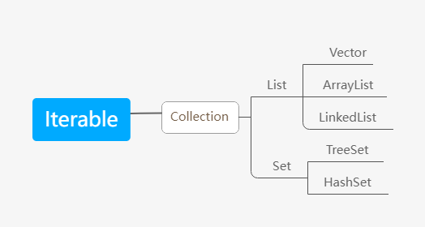
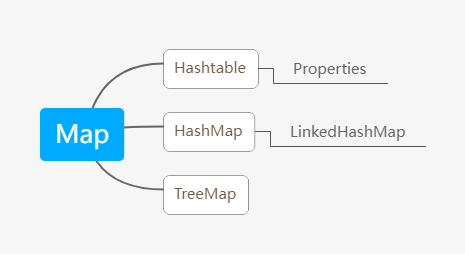

## 集合的理解和好处

1. 可以动态保存任意多个对象，使用比较方便
2. 提供了一系列方便的操作对象的方法：add,remove,set,get等
3. 使用集合添加，删除元素更简洁

## 集合的框架体系图

### 单列集合

### 双列集合

1. 集合主要是两组（单列集合，双列集合）
2. Collection接口有两个重要的子接口List，Set，他们的实现子类都是单列集合
3. Map接口的实现子类是双列集合，存放的是键值对K-V
