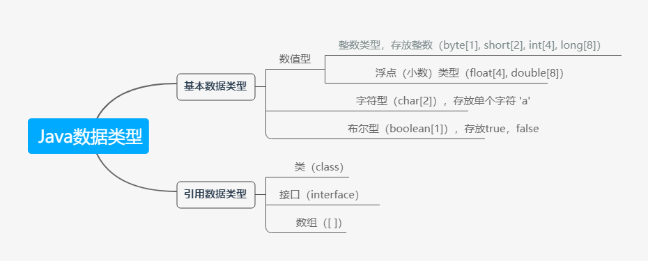

### 每一种数据都定义了明确的数据类型，在内存中分配了不同大小的内存空间（字节）



***

# 整数类型

- Java的整数类型有固定的范围和字段长度，不受具体OS（操作系统）影响，以保证Java程序的可移植性

- Java的整型常量默认为int型，声明long型常量后须加 'l' 或 'L'

- bit：计算机中的最小存储单位。byte：计算机中的基本存储单元，1 byte = 8 bit

***

# 浮点类型

- 与整数类型相似，Java浮点类型也有固定的范围和字段长度，不受具体OS影响
- Java的浮点型常量默认为double型，声明float型常量，须后加 'f' 或 'F'
- 通常情况下，应该使用double型，因为他币float型更精确
- 浮点型常量有两种表示形式：

			十进制数形式：5.12		512.0f		.512 （等价于0.512，必须有小数点）

			科学计数法形式：5.12e2（5.12\*10^2)		5.12E-2（5.12*10^-2）

-  浮点数使用陷阱:

```java
double num1 = 2.7;
double num2 = 8.1 / 3;  //结果是一个接近2.7的小数，而不是2.7

//应该是以两个数的差值的绝对值在某个精度范围内进行判断
if(Math.abs(num1 - num2) < 0.00001){
  System.out.println("差值非常小，认为相等")；
}
```

***

# 字符类型(char)

- 字符常量是用单引号（''）括起来的单个字符
- Java中还允许使用转义字符 '\' 来将其后的字符转变为特殊字符型常量
- 在Java中，char的本质是一个证书，在输出时，是unicode码对应的字符
- 可以直接给char赋一个整数，然后输出时，会按照对应的unicode字符输出

```java
char c = 97;
System.out.println(c);   //输出字符'a'
```

- char类型是可以进行运算的，相当于一个整数，因为他都有对应的unicode码

***

# 布尔类型（boolean）

- boolean类型数据只允许取值为true或者false，无null（不可以0或非0的整数替代false和true，这点与cpp不同）
- boolean类型占1一个字节
